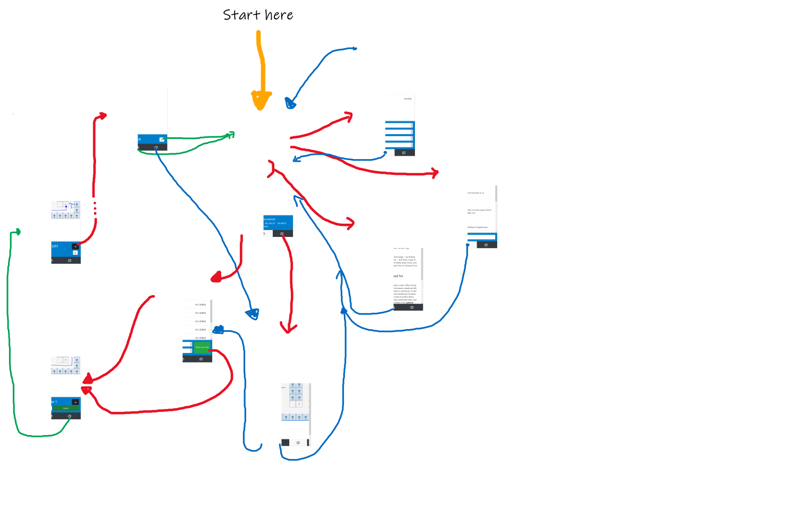

# VU Router 

Welcome to the *VU Router* Application. The application is aimed towards people who physically attend the VU. the app is primarily focused on how to 

<!-- ADD a TOC -->

## Target Audience
We understand that this is a very **wide** audience so we have created groups:

1. Individuals who work directly with the VU)
Students of the VU
    1. VU hosts
    2. Lecturers
    3. Researchers
    4. Spar customers
    5. Restaurant customers

2. Organizations who are affected by the spread of Covid-19
    1. Center for disease control (RIVM)
    2. Health care workers
    3. Hospitals
    4. Government (ministry of health)
    5. Emergency services
    6. Cleaners => See which areas are most crowded, and thus need the most cleaning

3. Complex gatherings that become more complex when trying to prevent spread of Covid-19
    1. Public gatherings (like open days, graduation, taster days) organisers
    2. Catering Industry => Bars where people can avoid busy hours
Sport centres  => Find when it is empty

4. Others who might use the system to find suitable routes for their special needs
    1. People who are part of a risk group for covid (diabetic, elderly, etc)
    2. People with a disability (e.g. wheelchair)

--- 
## Design choices made

This application was made with user interaction at the core of the design cycle. Upon entering the app (which is currently modeled as a website for mobile devices), the user will be given a choice from 3 menus: Study rooms, lecture halls, restaurants. From our user study, we found that these are the 3 most important elements for all 4 user groups described in *Target Audience*. From here on out, we will describe the page and its hierarchy of systems. 

This following inage is a design of the control flow for all pages. It shows the interaction between webpages. 

<!-- enter system cycle here. -->
> Click me to get vector image with high-resolution

Below we will outline what the purpose of each page is and design choices made while creating the page.

### Study rooms
This is a section where users will be able to find a place to study. We anticipate that mainly Students will be using this feature therefor, adding a route option would clutter the already small screen. We Assume that after 1 month of being at the VU, students will be famaliar with their way around the VU. 

In this section, users can filter the rooms on a variety of categories using a drop down menu. We choose a drop-down because all options are very small -- there will be no menu longer than 6 items --. We believe that displaying all options to the user is better than using a scroll function. 
<!-- I guess? Or else we should change this input method -->

On the side of each study room, there is a ratio in the form `(x/y)` where `x` is the current number of people in room and `y` is the max capacity. 

### Lecture halls
In this section, a user can quickly click a lecture hall and they will be routed from their current location -- depicted with GPS and Access point connection -- to the destination. At the bottom, the user will also find a search bar, where he/she can find rooms by name. 

In the future, we would like to only suggest rooms that we believe are relevant to the user (by schedule for example), to prevent all of the clutter tens of rooms can create on a small screen.

### Restaurants
Similar to *Lecture halls*, this section shows different restaurants at the VU. Below each restaurant name is the opening time and the business of the restaurant. Clicking on a retaurant will route the user from their current location to the restaurant. 

### The Nav bar
The nav bar will appear on almost every page, giving quick access to the Discover page (home), the search page and the map page. If for any reason the user were to get lost in the *very* narrow heirarchy of webpages, he/she will be able to go back to home from the NAV bar. 

### The Search page. 
This is a page where you can take a more specific, less trivial route. If the user wants to find a specific route, the user will be able to using this page. there is a location and destination bar to enter a custom route, as well as common routes on the page. When the user presses the `Route me now!` button, he/she will be redirected to the direction sequence.

### The route selector
When the use prompts a request that requires some route, the user wil be entered into this page. This page displays exactly three different routes, an Exepected Time of Arrival (eta) and a *heat number* which is the number of people around the route.

The user can toggle between routes using the `<-` and `->` arrows. The user can then commence the route using the green `Select!` button. If the user is at either bound number of routes, the arrows will be greyed out to signify their unavailability. 

### The routing sequence
After having selected a route, the user will be prompted to a dynamic routing page. In this page, the user can toggle steps in the same manner described in *The route selector*. At the bottom, the user will be displayed an ETA and a cancel button. When the user has finished all the steps, the bottom of the page will read `Destination reached`, and the user can press the `X` to go back home. 

### The map page
For this, we are using Azure services to create an interactable interface for a map we have created. this map has 3 floors, all of which can be explored by pressing the stairs. This is a very early stage prototype of what we would like, but this feature can be very useful for all groups. Azure allows you to create a 'feature filter', which means you can highlight services such as printers, restrooms, emergency exists etc. We attempted to create more complex floor plans, but creating a manifest for these was much more complicated than anticipated.

## Other features

### The emergency
triggered by pressing `CTRL + I` on the home screen. 